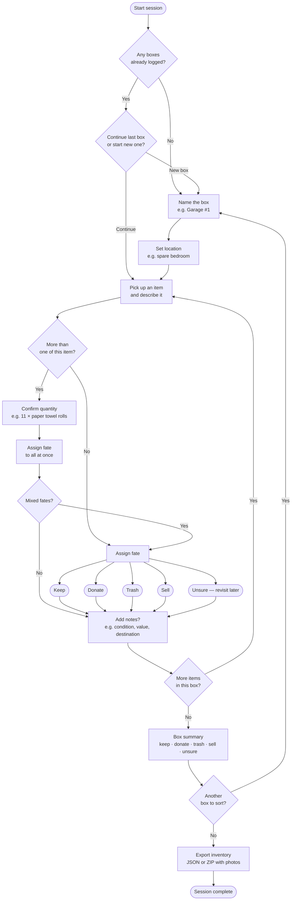

# Sortie — Declutter Companion

A browser-based chatbot that guides you through sorting boxes and their contents. Log every item, assign it a fate, attach photos, and export your inventory when you're done.

---

## Getting Started

No installation required. Open `index.html` in any modern browser (Chrome, Firefox, Safari).

```
index.html   ← open this
app.js       ← loaded automatically
```

Your data is saved to `localStorage` automatically as you work, so you can close the tab and pick up where you left off.

---

## How It Works

Sortie walks you through a structured workflow:

1. **Name a box** — give it a label and a location
2. **Pick up an item** — describe it to the bot
3. **Assign a fate** — keep, donate, trash, sell, or unsure
4. **Add notes** — optional condition, value, or destination
5. **Repeat** until the box is empty, then move to the next

> Open [flowchart.html](./flowchart.html) in a browser for a visual walkthrough of this workflow.



---

## Commands

Commands can be typed or tapped as suggestion chips. Single-letter shorthands are supported where noted.

| Command | Shorthand | What it does |
|---------|-----------|--------------|
| `new box` | — | Start logging a new box |
| `done with this box` | `done` | Finish the current box, see summary |
| `skip to next box` | — | Same as done, no summary |
| `review items` | — | List all items in the current box |
| `move <location>` | `m <location>` | Move the active box to a new location |
| `move` | `m` | Prompts for the new location |
| `remove <name or number>` | `delete <name or number>` | Remove an item from the active box |
| `remove` | `delete` | Prompts with usage hint |
| `review all boxes` | — | Summary of every box |
| `reset` | — | Clear all data (asks for confirmation) |
| `y` / `n` | — | Shorthand for yes / no at any prompt |

---

## Batch Entry

If you have multiple identical items, say so naturally:

> "eleven paper towel rolls"  
> "3 old magazines"

Sortie will detect the quantity, ask you to confirm, then log each as a separate entry — all sharing the same fate when you assign it.

---

## Exporting Your Data

| Button | Output |
|--------|--------|
| **Export JSON** | Structured inventory — all boxes, items, fates, and notes |

---

## File Structure

```
index.html          Browser entry point — HTML and CSS only
app.js              All application logic
test_move.js        Tests for the move box feature
CONTRIBUTING.md     Development guide — read before making changes
README.md           This file
flowchart.html      Visual process flowchart — open in browser
```

---

## Running Tests

```bash
node test.js
```

See [CONTRIBUTING.md](./CONTRIBUTING.md) for how to add new test files.

---

## Contributing

See [CONTRIBUTING.md](./CONTRIBUTING.md) for:

- How to add features (including the test requirement)
- The conversation state machine and how to extend it
- Safari / iOS compatibility rules
- The update checklist to run after every change
- The punchlist of planned features
